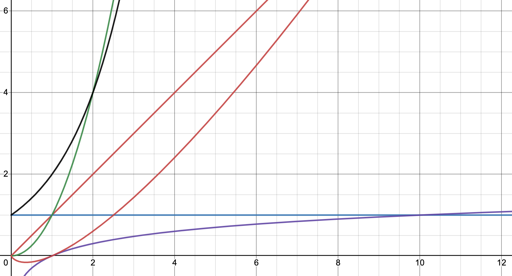

# Big O Notation:
[Home](landing.md)
[Next](stacks.md)
[Previous](list_comprehension.md)

## Intro
---

Big O Notation is a way of explaning how effective a function's performance/time in a WORST CASE scenario. It
is shorthand that will be used both in future programming classes, and in your future careers. This is a concept
that you will want to make sure you internalize and remember. You're gonna need it.

### Breaking it Down:
---
Here are the times you're going to need to be able to identify easily: O(1), O(n), O(n^2), and O(log n). Additionally,
we will also touch upon O(2^n) and O(n log n).
If we graph all these times in Desmos.com, then they will look like this:

At a glance, you can already tell some times will be better than others, but let's look at each individually.
#### O(1)
O(1): Constant time. An O(1) time function will always take the same time to complete, no matter how big the data set gets. When we plot it, we can see this visually.
.png)
In code, the easiest representation of O(1) would be an if statement.
```python
x = True
if x is True:
    print('x')
"""This is an O(1) or Constant time. 
If statements will alwasy take the same amount of time because 
they perform a literal comparison between two conditions."""
```
O(1) is the best possible time for your code to be in, and it won't affect other code you place it in unless you're adding a lot of them.
#### O(n)
O(n) is a scaling time that increases linearly. That's just a fancy way of saying for every x value, the y value increases the same. That's easiest to visualize with the graph below.
.png)
We can see that when x is 2, y is 2. When x is 6, y is 6. It's a linear increase. In code, it would be represented with a single 'for' loop, like this:
```python
x = 100
for i in range(x):
    print('hi')
#O(n) time - a linear increase.
```
In the above example, our 'x' value would be the range. As we increase that, the amount of times the function says 'hi' increases by the same amount. This is a O(n) time. You can also add more 'for' loops next to the first to increase the time.
```python
x = 10
for i in range(x):
    print('hi')
for i in range(x):
    print('bye')
#O(2n) - two loops of linearly increasing time.
```
With each additional NON-NESTED loop you place next to each other, you increase the value, so we can have O(3n) or O(4n) and so on.
>Make sure you put the number of additional loops on the LEFT of the n, for clarity.
#### O(n^2)
O(n^2) is an exponentially increasing time. This means that if x is 2, then y is 4. If x is 4, then y is 16. This is really bad for your computer/server, and completely unsustainable with bigger datasets.
.png)
In code, an O(n^2) would look like this:
```python
x = 10
for i in range(x):
    for i in range(x):
        print('hi')
# O(n^2) - exponentially scaling time. 
```
Much like O(n) above, you can also add additional nested loops next to each other to create O(2n^2) and if you nest the loops further than just these two, then you would have O(n^3), O(n^4) and so on. DON'T DO THIS! It is so inefficient! Find another way to make your code.
#### O(log n)
A logarithmic time. The best way to think of this is with a mental image. 

Imagine you have a phone book, and you're looking for a single name in it. The worst thing you could do is search through it name by name until you find what you're looking for. What a logarithm does is it goes to the center of the phone book and asks: "Is the name I'm looking for in the first half, or the second half of the phone book?" It then throws away the half it doesn't need, and asks this question over and over again, halving the size of the dataset until finally finds what it's looking for.

This makes logarithms excellent for massive datasets. No matter how big they get, the amount of steps needed to find the search value will still be significantly smaller than searching one by one.

It looks like this on a graph:
.png)
In code, like this:
```python
def log(dataset, goal):
    """
    Search for 'goal' in the list 'dataset'
    When its found (or not found) the variable count
    which represents the work done in the function 
    is returned.
    """
    if len(dataset) == 0:
        return "empty"     # All done
    center = len(dataset) // 2
    if dataset[center] == goal:
        return "complete"     # Found it
    elif dataset[center] < goal:   # Search in the upper half after index center
        return 1 + search_sorted_2(dataset[center+1:], goal)
    else:                         # Search in the lower half before index center
        return 1 + search_sorted_2(dataset[:center], goal)
data = [x for x in range(100)]
goal = 12
print(log(data, goal))
```
Don't worry too much about fully understanding the code at this point. The goal of showing you it is so that you understand what O(log n) looks like. You'll learn how to create and interact with one of these later in the semester.
#### O(n log n) and O(2^n)
O(n log n) and O(2^n) are two other times you need to know of, but don't necessarily need to know too much about. 
O(n log n) on a graph looks like this:
.png)
Worse than a O(n) time, but better than O(n^2).
And O(2^n) looks like this:
.png)
The worst possible time - even worse than O(n^2).

### Practice
Identify the following function's times:
```python
x = 10
b = True
def first():
    if b is True:
        print('yes')
def second():
    for i in range(x):
        print('no')
def third():
    for i in range(x):
        print('hi')
    for i in range(x):
        print('bye')
    for i in range(x):
        print('later')
def fourth():
    for i in range(x):
        for i in range(x):
            print('Stop!')  
def fifth():
    for i in range(x):
        for i in range(x):
            for i in range(x):
                if b is True:
                    print('hi')
    for i in range(x):
        for i in range(x):
            for i in range(x):
                if b is True:
                    print('hi')
def sixth():
    '''Create a function that prints a phrase with a time of O(n).
    Use the variable 'x' for your range.'''
def seventh():
    '''Create a function that prints a phrase with a time of O(4n^2)
    DON'T CALL THIS FUNCTION, YOUR COMPUTER WILL CRY!
    Use the variable 'x' for your range.'''
def eigth():
    '''Turn this O(n^2) into a O(2n).
    Use the variable 'x' for your range.'''
    for i in range(x):
        print("I'm broken")
        for i in range(x):
            print('fix me')
```
[Answers](o_answer_key.md)